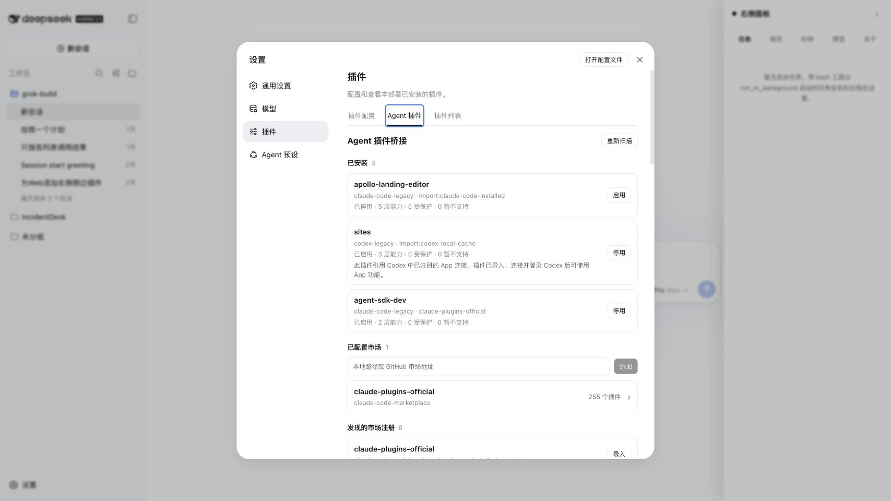
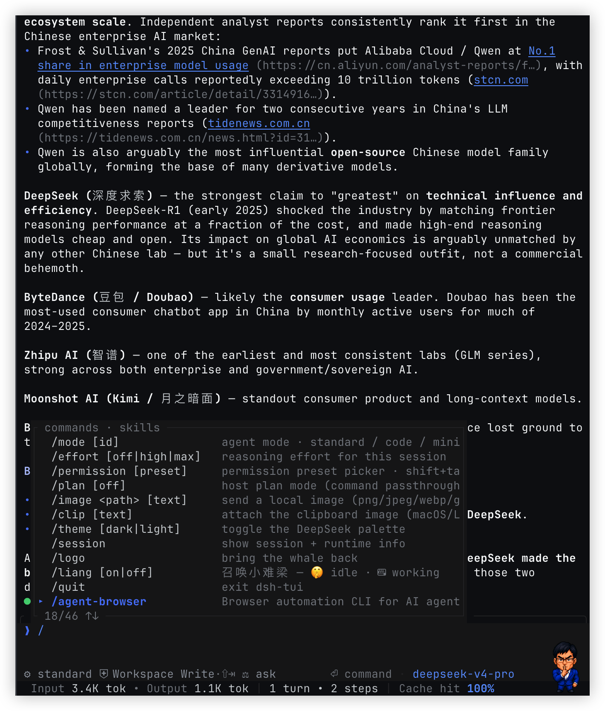

<h1 align="center">dsh Agents Plugins Bridge</h1>

<p align="center">
  Install Agent Plugins, Codex plugins, Claude Code plugins, and Pi packages in
  DeepSeek Harness with one bridge package.
</p>

<p align="center">
  <a href="https://www.npmjs.com/package/@openma/dsh-agents-plugins-bridge"></a>
  <a href="https://www.npmjs.com/package/@openma/dsh-agents-plugins-bridge"></a>
  <a href="https://github.com/openma-ai/dsh-agents-plugins-bridge/actions/workflows/release.yml"></a>
  
  <a href="LICENSE"></a>
</p>

---

The Bridge is a normal [DeepSeek Harness](https://github.com/deepseek-ai/deepseek-harness)
bundle: one install entry, many small Cordis plugins. It detects foreign package
formats, copies an explicitly selected package into profile-local storage, and
materializes every supported capability as its own reversible DSH row. It does
not emulate another agent runtime or hide everything behind one universal
plugin.

## Quick start

Node.js 22.19 or newer is required. Install DSH first, then add the same Bridge
package to every profile that should use foreign plugins:

```sh
npm install -g @deepseek-ai/dsh

# Web management UI + shared Host capabilities
dsh plugin --profile web add @openma/dsh-agents-plugins-bridge@latest
dsh web

# Terminal UI + the same shared Host capabilities
dsh plugin --profile tui add @openma/dsh-agents-plugins-bridge@latest
dsh --profile tui
```

DSH profiles are separate compositions, so installing into `web` does not
silently mutate `tui`, and vice versa. Users install only the root Bridge
package. It carries the Web surface, the format adapters, and MCP Apps support
through its own dependency graph.

### Web

Open **Settings → Plugins → Agent plugins** to scan local Codex, Claude Code,
and Pi state; register or import marketplaces; search catalogs; install a
plugin; inspect per-plugin capability rows and diagnostics; and manage Pi
package update checks.



The Web panel is a management surface over the Host runtime. Closing the panel
does not stop installed hooks, commands, skills, MCP servers, or Pi extensions.

### TUI

TUI does not need a second Bridge implementation. `/plugin-bridge`, imported
slash commands, and user-invocable skills are projected from the same Host
composition through ACP and appear in the TUI's normal searchable command
menu. Hooks, monitors, MCP connections, agents, LSP rows, and Pi extension
lifecycle stay on the Host and continue to work without a browser.

<p align="center">
  
</p>

The screenshot comes from the
[DeepSeek Harness TUI](https://github.com/openma-ai/deepseek-harness-tui), whose
command menu is the surface Bridge commands and imported skills join.

MCP Apps are the intentional exception: the shared MCP connection, tools,
resources, prompts, and backend hooks work in TUI, but untrusted App HTML is
rendered only by the Web sandbox. The terminal does not execute browser UI.

### Headless owner

Pi extensions such as `pi-telegram` may require one live Session even when no
UI is open. Use
[Martty owner](https://github.com/openma-ai/deepseek-harness-tui/blob/main/README.en.md#martty-owner-long-lived-headless-acp--pi-rpc)
for that process lifecycle. Bridge still owns import, materialization, hooks,
tools, commands, and extension runtime; Martty is the generic ACP `rpc` client
that keeps the Session alive and invokes only explicitly advertised startup
and shutdown commands. It does not auto-approve permissions or answer
extension forms.

| Capability | Web | TUI |
|---|:---:|:---:|
| Discover, import, install, enable, disable, uninstall | panel + command | command |
| Skills, slash commands, prompt templates | yes | yes |
| Codex and Claude Code hooks | yes | yes |
| MCP tools, resources, prompts, and server lifecycle | yes | yes |
| Claude agents, output styles, monitors, and LSP | yes | yes |
| Pi extensions, tools, commands, skills, and lifecycle | yes | yes |
| Foreign browser themes | yes | no |
| MCP Apps HTML/AppBridge renderer | yes | no |

## Use the Bridge

Inspect the active Bridge and read-only discovery results:

```text
/plugin-bridge
/plugin-bridge marketplace list
/plugin-bridge discover
/plugin-bridge marketplace discover
```

Add a local marketplace directory or GitHub repository, then install one
catalog entry:

```text
/plugin-bridge marketplace add /absolute/path/to/marketplace
/plugin-bridge marketplace add https://github.com/company/agent-plugins
/plugin-bridge marketplace add company/agent-plugins@main
/plugin-bridge install deployment-tools@company-tools
```

Import state that another agent has already registered locally:

```text
/plugin-bridge discover
/plugin-bridge import codex-local-cache:personal/deployment-tools/1.2.3
/plugin-bridge marketplace discover
/plugin-bridge marketplace import claude-code-registered-marketplaces:company-tools
```

Discovery is read-only. Import first copies the selected package or catalog
into profile-local Bridge storage; foreign agent directories are never executed
or modified in place. Install and import then share the same format detection,
component adapters, Loader transaction, rollback, and durable state.

`disable` removes live rows but keeps the copied package, `enable` restores the
eligible stored plan, and `uninstall` moves the package copy into profile-local
trash.

## Architecture

The layout follows DSH's standard plugin shape:

```text
root bundle patch
  ├─ kernel + one provider/locator/adapter per capability dialect
  ├─ runtime + /plugin-bridge command
  ├─ package-owned Web gateway/client wrappers
  └─ package-owned MCP Apps Host/Web wrappers
       └─ resolve dependency from Bridge's graph → Loader import → ctx.plugin

installed foreign package
  └─ normalized components
       ├─ skill row
       ├─ MCP connection row(s)
       ├─ hook row(s)
       ├─ command / agent / monitor row(s)
       └─ Pi extension row(s)
```

Package-owned wrapper entries are important under pnpm: the profile resolves
only `@openma/dsh-agents-plugins-bridge/*`; each wrapper resolves its runtime
from the Bridge package's own dependency graph, imports it through DSH's Loader,
and mounts it as a child Cordis plugin. Transitive dependency hoisting is never
part of the runtime contract. Web-capable wrapper rows also expose their own
`<row>/package.json` plus an exact-id browser bundle, so DSH's official
`dsh.client` scanner builds the Browser tree from the same row instead of
requiring a second UI package in the profile.

The lifecycle kernel exposes six reversible registries:

```text
MarketplaceProvider   discovers marketplace catalogs and resolves package sources
PackageFormatProvider recognizes and normalizes an extracted plugin package
ComponentAdapter      maps normalized components onto explicit dsh Cordis rows
InstalledPluginLocator observes one agent's local plugin registry/cache
MarketplaceRegistrationLocator observes one agent's registered catalogs
ActivationPolicy      inspects and gates rows that require explicit user trust
```

Every successful installation compiles to explicit rows. Each capability can
load, fail, reload, disable, and uninstall independently. An MCP manifest
expands again so every configured server owns its own
`@deepseek-ai/dsh-mcp-client` row.

MCP tools, resources, prompts, and Apps reuse one MCP SDK connection. The
Bridge includes the Host and Web halves from
[`@openma/dsh-mcp-apps`](https://github.com/openma-ai/dsh-mcp-apps) through two
independent package-owned wrappers. A Codex registered App is the foreign-host
exception: its relay owns one Codex app-server process because Codex still owns
that connection and OAuth lifecycle.

Hook rows use the same dependency-wrapper pattern for DSH's official Codex and
Claude Code hook plugins. The wrapper row owns the nested plugin fiber, so Web
and TUI share one Host lifecycle without requiring the profile to install or
hoist those runtime packages separately.

## Portable package core

Agent Plugins 1.0 is the portable core. The current provider recognizes the canonical root manifest:

```json
{
  "$schema": "https://agent-plugins.org/schemas/1.0.0/plugin.schema.json",
  "name": "minimal-plugin"
}
```

It discovers standard components only at their fixed locations:

- `skills/` for Agent Skills
- `mcp.json` for MCP servers

The bridge first verifies that `skills/` is a directory and `mcp.json` is a regular file. A wrong entry type disables only that component and produces an install diagnostic. A valid `skills/` directory becomes one isolated `@deepseek-ai/dsh-skill-filesystem` row; that dsh provider discovers immediate `<name>/SKILL.md` bundles and warns and skips malformed entries without dropping valid siblings. Per-skill parse warnings therefore belong to the dsh skill provider rather than the bridge install result.

Schema selection is local and keyed by the canonical `$schema` identifier. Plugin loading never downloads a schema. The provider enforces Agent Plugins name constraints and the closed author object. Unknown top-level fields and a non-object `extensions` field remain visible diagnostics without becoming portable semantics.

Portable `mcp.json` uses its own adapter row, separate from Codex and Claude MCP compatibility. Every valid server becomes one Loader row. The adapter supports `stdio` and `streamable-http`, validates their closed variants, applies only the standard `${PLUGIN_ROOT}` and `${PLUGIN_DATA}` substitutions in `args`, `env`, and `cwd`, and injects a persistent per-installation `PLUGIN_DATA` directory. Invalid individual servers and dsh's unsupported legacy `sse` transport are skipped with diagnostics while independent skills and servers keep loading.

Codex `.codex-plugin/plugin.json` and Claude Code `.claude-plugin/plugin.json` layouts are compatibility providers; they do not redefine the portable core.

## Compatibility

| Source | Catalog | Package | Materialized components |
|---|---|---|---|
| Agent Plugins 1.0 | marketplace dialect not standardized | `plugin.json` | `skills/`, `mcp.json` |
| Codex | `.agents/plugins/marketplace.json` | `.codex-plugin/plugin.json` | skills, MCP servers, registered Apps, Codex hooks |
| Claude Code | `.claude-plugin/marketplace.json` | `.claude-plugin/plugin.json` | skills, MCP servers, hooks, commands, agents, output styles, monitors, themes, LSP servers |
| Pi | no marketplace registry | `package.json` with `pi`, or convention directories | extensions, skills, prompt templates, themes |

Codex marketplace parsing follows the [official OpenAI packaging reference](https://developers.openai.com/plugins/build/plugins): local sources may be a `./` string or `{ "source": "local", "path": "./..." }`; HTTPS `url` and `git-subdir` entries honor `ref` or `sha`. Git subdirectories are copied from a root-contained path after clone. The documented `npm` source is rejected with an explicit unsupported diagnostic because reproducing Codex's no-lifecycle-script install safely is not implemented yet.

Claude marketplace-local directories plus the official `github`, HTTPS `url`, and `git-subdir` source shapes are supported. Git subdirectories must remain root-contained and `ref` or `sha` pins are preserved. The documented `npm` source remains an explicit unsupported error; unknown source shapes are never guessed or silently downgraded. GitHub marketplace URLs and `owner/repo@ref` shorthand are cloned without a shell.

### Local discovery boundaries

Codex plugin discovery reads only `[plugins."plugin@marketplace"]` registrations from `~/.codex/config.toml`, then resolves matching versioned copies under `~/.codex/plugins/cache/<marketplace>/<plugin>/<version>`. Results retain the configured enabled/disabled state and are labeled `plugin-cache`, because Codex does not expose a separate installed-path JSON registry there. The broad `~/.codex/.tmp/plugins` catalog sync is deliberately ignored and is never presented as installed state.

Claude Code plugin discovery reads its explicit `~/.claude/plugins/installed_plugins.json` registry and labels results `installed-registry`. It does not infer installations from marketplace checkout or cache contents.

Pi package discovery reads the explicit `packages` arrays in `~/.pi/agent/settings.json` and the current project's `.pi/settings.json`. It resolves Pi's managed npm and git install roots plus local paths relative to the owning settings file. Pi has no marketplace registry: npm, git, and local paths are package sources, while the public package gallery is discovery metadata rather than a catalog registration. The `pi-package` keyword alone never claims an ordinary Node package.

Pi package manifests may declare extensions, skills, prompt templates, and themes, or use the matching convention directories. A dedicated Pi skill provider preserves exact files, directories, recursive `SKILL.md` discovery, flat Markdown skills, glob expressions, and `!` exclusions before registering each definition on `ctx.skills`. Prompt resources preserve the same path-expression boundary and become namespaced DSH slash commands. Theme JSON resolves Pi variables and xterm-256 colors, maps the roles DSH exposes, and registers browser themes through the independent theme client row. Pi extensions load through an agent-scoped compatibility host that maps their commands, tools, UI questions, and lifecycle callbacks onto DSH.

Registered marketplace discovery is a different provider layer. Codex reads only `[marketplaces.<name>]` entries from `~/.codex/config.toml`; Claude Code reads only `~/.claude/plugins/known_marketplaces.json`. Claude `installLocation` and Codex local sources are copied before registration. Supported GitHub Codex Git registrations are reacquired through the existing safe marketplace manager. Malformed, missing, duplicate, or unsupported entries become per-provider diagnostics and do not suppress valid siblings.

Unsupported legacy components remain in the install result instead of disappearing silently. Claude agents become namespaced DSH subagent tools; only explicitly mapped Claude tool names enter their allow-list, and unsupported model overrides remain diagnostics. Ordinary output styles register per-Agent `/output-style-<plugin>-<style>` commands, while `force-for-plugin` styles follow Claude's automatic replace or `keep-coding-instructions` behavior. Monitors use only the verified `always` and `on-skill-invoke:<name>` lifecycle seams and run through DSH's subprocess service. Missing required fields and unknown variants produce diagnostics and no row—there is no basename, default-description, event, or model fallback. Future OpenCode dialects still need a matching DSH seam or runtime compatibility layer. MCP Apps returned by a bundled MCP server work through the shared dsh MCP connection.

The Codex Apps adapter recognizes `.app.json` registered-connection identifiers without treating opaque IDs as executable MCP configuration. A same-name bundled MCP server resolves the App directly. Otherwise each declared connection compiles into two independent rows: a standard `@deepseek-ai/dsh-mcp-client` row that launches `codex-host-relay`, and a DSH tool-approval policy row. The relay uses `codex app-server --stdio`, verifies `app/installed` says the connection is enabled and callable, opens an ephemeral thread, filters the `codex_apps` catalog by connector ID, and proxies that App's tools, resources, resource templates, tool `_meta`, result `_meta`, and structured content. It never reads or copies Codex's OAuth database or tokens. Codex app-server does not currently expose hosted-App prompts through its direct MCP status/call surface, so the relay advertises no invented prompts; ordinary bundled MCP servers still retain their native prompt lifecycle.

Read-only classification comes from the hosted tool annotations. Declared read-only calls pass through; writes ask through DSH's normal approval seam, and a new tool absent from the inspected catalog is treated as a write. The foreign-host requirement remains attached so Web can explain that Codex must be installed, connected, and signed in. Durable installations intentionally restore their exact stored row plan, so a plugin imported by an older bridge build must be uninstalled and imported again to acquire newly added adapter rows.

## Commands

The owned command namespace is `/plugin-bridge`:

```text
/plugin-bridge marketplace add <url>
/plugin-bridge marketplace discover
/plugin-bridge marketplace import <locator:key>
/plugin-bridge marketplace list
/plugin-bridge install <plugin>@<marketplace>
/plugin-bridge discover
/plugin-bridge import <locator:key>
/plugin-bridge enable <plugin>
/plugin-bridge disable <plugin>
/plugin-bridge uninstall <plugin>
```

Discovery is always read-only and the first import is always explicit. Imported host snapshots are reconciled once when the runtime starts and every five minutes by default; set `autoUpdateIntervalMs` to another positive interval or `0` to disable polling. Codex reconciliation follows SemVer precedence across its versioned cache. Claude Code follows the exact active entry in `installed_plugins.json`, including an upstream rollback. Pi local-path packages remain explicit-only. Content digests also detect changes without a new version string. A replacement is copied and validated before its rows are swapped at the existing Bridge-owned root; any acquisition, validation, activation, or persistence failure restores the previous package and active rows.

Pi npm and Git packages additionally use Pi's public native package-manager API. The Web panel defaults to **Notify only**, checks at startup when due and then every six hours, and lists updates only for Pi packages already imported into this Bridge profile. Users can choose **Update automatically** or **Turn off checks**, exclude individual packages from automatic updates, check immediately, and update one package or all available packages. Manual actions ignore automatic-update exclusions. Pins, npm and Git behavior, user/project scope, and package installation layout remain owned by Pi; the Bridge does not implement a second npm or Git updater. Native package sources stay on the Host and the Web client receives only opaque IDs. Set `piUpdateCheckIntervalMs` to another positive interval or `0` to disable background checks; manual checks remain available.

Imported Claude output styles expose their generated selection commands in the normal DSH command registry. Hook rows do not add a second digest-approval gate: importing and enabling the plugin activates the native DSH Codex or Claude Code hook bridge directly.

## Safety and lifecycle

- Package paths and symlink targets cannot escape the copied plugin root.
- Foreign plugin and marketplace directories are never modified; explicit imports copy first.
- Marketplace relative sources reject absolute paths and traversal.
- Git is invoked with argument arrays and never through a shell.
- Portable MCP subprocesses receive fixed bridge-owned `PLUGIN_ROOT` and `PLUGIN_DATA`; arbitrary `${ENV}` expansion is not performed for the portable dialect.
- Codex registered-App credentials stay inside Codex; the relay uses the public app-server protocol and persists only the opaque connection identifier already declared by the plugin.
- Codex App tools marked non-read-only, plus unknown future tools in that relay namespace, require DSH approval before dispatch.
- Loader activation and state persistence roll back together on failure.
- Foreign executable modules are never run during discovery. Explicit import plus enable is the execution consent boundary; Pi extensions and Codex and Claude Code hooks do not add a duplicate digest-approval step.
- Registration, row activation, disable, and disposal are reversible.
- Uninstalled package copies move to profile-local trash rather than being recursively deleted.

## Related projects

| Project | Use it for |
|---|---|
| [DeepSeek Harness](https://github.com/deepseek-ai/deepseek-harness) | The everything-is-a-plugin Host, Loader, Web surface, and capability services |
| [DeepSeek Harness TUI](https://github.com/openma-ai/deepseek-harness-tui) | Terminal-native ACP client; receives Bridge commands and skills from the shared Host composition |
| [DeepSeek Harness ACP](https://github.com/openma-ai/deepseek-harness-acp) | Exposes the same Host commands, skills, tools, and sessions to ACP clients such as Zed |
| [dsh-mcp-apps](https://github.com/openma-ai/dsh-mcp-apps) | Standalone MCP Apps Host and sandboxed Web renderer; already included by this Bridge |
| [Agent Plugins](https://agent-plugins.org/) | Portable plugin manifest, skills, and MCP package standard |
| [Pi packages](https://pi.dev/packages) | Pi package gallery and extension ecosystem |

Install the Bridge when the goal is to consume Codex, Claude Code, Pi, or
portable Agent Plugins. Install `@openma/dsh-mcp-apps` directly only when a
profile needs MCP Apps rendering without the foreign-plugin compatibility
layer.

## Development

```sh
npm install
npm test
npm run typecheck
npm run build
```

Git installations run `prepare` to produce `lib/`. pnpm 10 may require the user to allow that build script explicitly; registry releases and packed tarballs ship built output.
